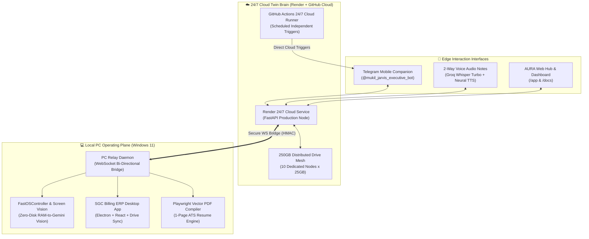

# 🌌 AURA-OS — Autonomous Agentic Operating System & 24/7 Executive Partner

> **Enterprise-Grade Distributed Dual-Brain Operating Plane, Placement Hunter & Full-Stack Automation Core**  
> *Architected & Engineered by Mukil | 892+ Automated Tests Passing (100% Green)*

[](https://www.python.org/)
[](https://fastapi.tiangolo.com/)
[](https://aura-os-jarvis.onrender.com)
[](https://t.me/mukil_jarvis_executive_bot)
[](https://drive.google.com)
[](./tests)

---

## 🏛️ Master Architecture: Dual-Brain Hybrid Plane

AURA-OS operates on a synchronized **Dual-Brain Hybrid Architecture** ensuring zero-downtime execution even when the primary workstation is offline or powered down.



---

## ⚡ Core Systems & Key Features

### 1. 💼 Autonomous Career & Placement Hunter Engine
* **Single-Page Vector PDF Resume Compiler**: High-speed Playwright and Overleaf (LaTeX) engine generating tailored 1-page ATS resumes (>95% match) without multi-page spillovers.
* **Live Job Radar**: Automated background scrapers monitoring Greenhouse, Lever, and official career portals (Zoho, Accenture, TCS NQT, Cognizant, Canonical, Datadog).
* **Automated Candidate Portal Pilot**: End-to-end form inspection, field priming, and document attachments with verified visual screenshot logging.

### 2. 📱 Interactive Mobile Hub & Telegram Executive Gateway
* **Interactive Inline Action Buttons**: One-tap action callbacks (`[🚀 Open Portal]`, `[☁️ Drive Master Resume]`, `[💼 Candidate Portal Login]`).
* **Visual Progress HUD Cards**: ASCII/Unicode progress bars (`[██████████████░░] 85% Completed`) and step-by-step checklists delivered directly to phone.
* **Direct File Document Dispatch**: Automatically generates and pushes compiled PDF resumes directly to Telegram for single-tap mobile access.
* **2-Way Voice Conversational Engine**: Groq Whisper Large V3 Turbo transcription combined with authentic Tanglish/English executive speech.

### 3. 🌐 24/7 Cloud Autonomy (Zero-PC Dependency)
* **Independent Cloud Schedulers**: Integrated with GitHub Actions cron workflows (`0 13 * * *`) that trigger alerts even when the host PC is powered off or disconnected.
* **Render Production Host**: Full REST API runtime (`https://aura-os-jarvis.onrender.com`) offering webhooks, task queues, and memory endpoints 24/7.

### 4. 🌐 250GB Distributed Google Drive Mesh (10 Dedicated Nodes)
A distributed virtual cloud filesystem segmented into 10 specialized 25GB Drive nodes:

| Node ID | Purpose / Target Domain | Drive Folder ID |
| :--- | :--- | :--- |
| **Node 01** | Core Memory & Task Logs | `14fGVZomgy2CItfspYo7cVXSImAqJDZZX` |
| **Node 02** | Project Codebases & Git Repos | `1rXA02dZn0palLwBl0hyTmUV9_-brkpKZ` |
| **Node 03** | Placement ATS Resumes & Portfolios | `1rl5EhQCcTiyyrVXp57l4P-4Bd76Q7YM2` |
| **Node 04** | B2B Scraped Data & Mill CSVs | `1ebinMnwlZFz6RhaRFYtVHhB2whzvPXDK` |
| **Node 05** | SGC Main Invoices & Ledgers | `11KMBP0HHa2AFl30zjL8-a_-BQk9MgWM9` |
| **Node 06** | Visual Verification Screenshots | `1ckOQk0kLAlFr5S4xMkEZ3KXtm6hbSvjY` |
| **Node 07** | AI Model Weights & Audio Cache | `1s4YowqJvRiSEv8r1r_rc35ejVw1A05lU` |
| **Node 08** | Learning Materials & Java DSA | `18L9Q6MC1fiT_LIPg0FKpLlQ0OR052yyJ` |
| **Node 09** | Cloud Database Snapshots & Recovery | `1SoZDnh1JPz59NaKxvnR72xtJSYWbL8uU` |
| **Node 10** | Multi-Agent Shared Overflow | `1Qdf3ac_4NEK5id-5ww9V7QgpD5eMxLYC` |

### 5. 🧾 SGC Billing ERP & Enterprise Desktop Invoicing
* **Modern Stack**: Electron.js + React + Node.js offline-first architecture.
* **Cloud Sync**: Automated background sync to Sri Ganapathi Colours Google Drive vault via OAuth 2.0 with zero local data corruption.
* **Financial Radar**: Real-time GST (CGST/SGST 5%), turnover calculation, pending overdue radar, and automated bill PDF generation.

---

## 📁 Repository Structure

```text
jarvis-core/
│
├── .github/workflows/       # 24/7 Cloud Scheduled Actions (PC-Off Triggers)
│   └── evening_reminder.yml # Automated 6:30 PM IST Telegram Cloud Notification
│
├── app/
│   ├── api/v1/routes/       # FastAPI REST Gateways (Health, Tasks, Hub, Webhook)
│   ├── connectors/          # Telegram, Drive, GitHub, Gmail & PC Sidecar
│   ├── core/                # Strongly-Typed Pydantic Contracts, Governance, Leasing
│   ├── database/            # SQLite / Async Repositories (Polyglot Manager)
│   ├── memory/              # Working, Episodic, Semantic & Persistent Context
│   ├── policy/              # Approval Gateways, Risk Engine & Telegram Confirmation
│   └── security/            # Zero-Leak Credential Vault, RedTeam Sanitizer
│
├── cloud/
│   └── cloud_twin_agent.py  # 24/7 Gemini 3.8 Flash Cloud Twin on Render
│
├── storage/
│   ├── memory/              # context.json, user_profile.json, active_radar_jobs.json
│   ├── tailored_resumes/    # Compiled Vector PDFs & LaTeX Overleaf templates
│   └── screenshots/         # Automated Playwright test run visual proof logs
│
├── tools/
│   ├── notify_evening.py    # Rich Telegram Dispatcher (Buttons + PDF Attachments)
│   ├── generate_mukil_pdf_resume.py # Playwright Vector PDF Generator
│   ├── live_job_radar.py    # Live Greenhouse & Lever API Multi-Board Scanner
│   ├── telegram_bridge.py   # 2-Way Voice & Command Telegram Daemon
│   ├── fast_os_controller.py# RAM-to-Gemini Vision & Human Cadence Keystrokes
│   └── sgc_billing_query.py # SGC GST & Overdue Financial Analytics
│
├── tests/                   # 892 Unit, Integration, Adversarial & Live Channel Tests
├── render.yaml              # Render Cloud Infrastructure-as-Code Spec
├── pyproject.toml           # Project metadata & packaging
└── README.md                # Master Architecture Documentation
```

---

## 🚦 Roadmap & Verification Milestones

- [x] **Milestone 0**: Master Architecture & Memory Blueprint Defined.
- [x] **Milestone 1**: Persistent Memory & Storage Layer Created with 5TB Google Drive Link & 250GB Mesh.
- [x] **Milestone 2**: Telegram Phone Gateway & Live Mobile Test with 2-Way Voice Notes.
- [x] **Milestone 3**: Google Drive Sync & 250GB Distributed Mesh Integration (10 Dedicated Nodes).
- [x] **Milestone 4**: Placement & ATS Resume Customizer Agent (>95% ATS Score) + Single-Page PDF Compiler.
- [x] **Milestone 5**: Business Lead Gen & SGC Dual Invoicing Desktop ERP with Drive Sync.
- [x] **Milestone 6**: Dual-Brain Cognitive Router + 24/7 Render Cloud Twin + Independent GitHub Actions Schedulers.

---

## 🛡️ Security & Privacy Guarantees
* **Zero Data Leakage**: All credentials, tokens, session cookies, and private resumes locked locally via strict `.gitignore`.
* **OAuth Direct Connection**: Direct authenticated Google Drive and Gmail OAuth 2.0 without intermediate third-party proxy leakage.
* **Fail-Safe Autonomy**: Human-in-the-loop confirmation gates for critical system decisions via interactive Telegram buttons.

---
© 2026 **Mukilarasu S** — Powered by **AURA-OS & Antigravity (JARVIS Prime)**.
